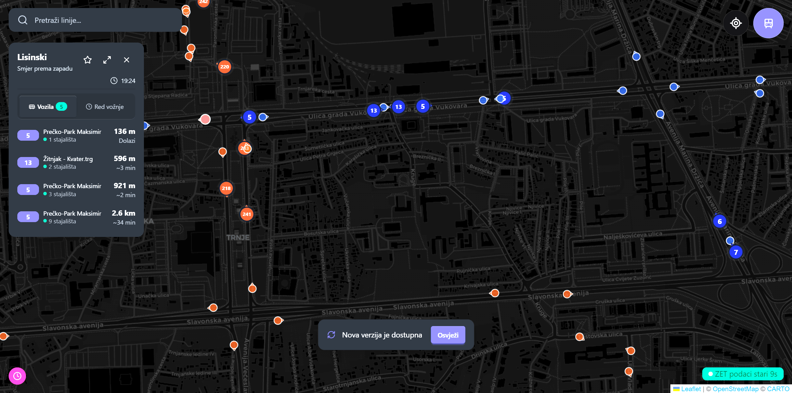

<div align="center">

# Kreni — Zagreb's All-In-One Mobility & City Service Map

  

**All on one map: track ZET trams and buses live, find free parking spots, public garages, Nextbike bicycles, and cycling paths in Zagreb. Also includes locations of public water fountains, EV charging stations, and student cafeterias.**

[](LICENSE)
[](https://github.com/m-t-e-o/kreni-app/actions)
[](https://github.com/m-t-e-o/kreni-app/actions)
[](http://makeapullrequest.com)

[**Live Demo**](https://kreni.app/) • [**Report Bug**](https://github.com/m-t-e-o/kreni-app/issues) • [**Request Feature**](https://github.com/m-t-e-o/kreni-app/issues)

</div>

---

## ✨ Overview

Kreni is a high-performance, **completely static** urban mobility dashboard for Zagreb. Unlike traditional city apps that rely on heavy backend databases, Kreni pre-processes massive datasets (GTFS transit feeds, city infrastructure, and real-time APIs) into hyper-optimized JSON shards.

Served directly from a global CDN, it provides sub-second load times and seamless offline support, making it the most reliable way to navigate the city.

### 🚀 Key Features

<table>
  <tr>
    <td width="33%" valign="top">
      <h4>🚋 Transit Tracking</h4>
      Live positional updates for <b>ZET</b> buses/trams and <b>HŽPP</b> trains with smooth map interpolations.
    </td>
    <td width="33%" valign="top">
      <h4>🅿️ Smart Parking</h4>
      Find free parking spots and public garages with real-time availability across the city.
    </td>
    <td width="33%" valign="top">
      <h4>🚲 Cycling & Micro-mobility</h4>
      Integration with <b>Nextbike</b> stations and detailed maps of Zagreb's cycling paths.
    </td>
  </tr>
  <tr>
    <td width="33%" valign="top">
      <h4>🚰 Public Utilities</h4>
      Locate public water fountains (česme) and <b>EV charging stations</b> near you.
    </td>
    <td width="33%" valign="top">
      <h4>🎓 Student Life</h4>
      Essential map of student cafeterias (<b>menze</b>) for the ZG student community.
    </td>
    <td width="33%" valign="top">
      <h4>⚡ Edge Computing</h4>
      Zero-database architecture using <b>Cloudflare Pages + KV</b> for virtually infinite scalability.
    </td>
  </tr>
</table>

## Screenshots

<div align="center">
  <br/>
  <i>Integrated City Dashboard View</i>
</div>

---

## Built With

<div align="center">
  
  
  
  
  
  
  
</div>

---

## Architecture & Infrastructure

The power of Kreni lies in its automated data ingestion pipelines:

### 1. The Slicing Engine (`deploy.yml`)

At build time, the CI downloads 114+ MB of raw GTFS archives and city-level GeoJSONs. It then "slices" them into thousands of minimal, pre-calculated JSON files.

- **`initial.json`**: Core app state.
- **`shapes/`**: High-precision vector paths.
- **`data/`**: Highly sharded stop and route metadata.

### 2. AI Service Alerts (`parse-service-alerts.yml`)

A cron job fetches unstructured official announcements. An **AI agent (Ollama)** parses them into structured JSON, which is then pushed to Cloudflare KV for the frontend to consume.

### 3. Mobile & Platform Strategy

Kreni is **web-first**, and this repository is the complete, free web/PWA
frontend. The native Android app is built with **Capacitor** (wrapping this
React/Leaflet web app unchanged) and, together with the transit data pipeline
and premium/monetization features, is developed and distributed from a separate
private repository under an **open-core** model. Maps stay on **Leaflet** until
marker performance forces a move to **MapLibre GL JS**.

The full documentation vault lives in **[docs/Home.md](docs/Home.md)**.

---

## Quick Start

### Prerequisites

- **Node.js**: 20+

### Installation

```bash
git clone https://github.com/m-t-e-o/kreni-app.git
cd kreni-app

# 1. Install dependencies
yarn install

# 2. Start the dev server. The static GTFS dataset is produced by a private
#    pipeline and isn't committed here; `yarn dev` proxies it from production
#    (see vite.config.ts), so the map runs with live data out of the box.
yarn dev
```

### Script Commands

| Command         | Description          |
| :-------------- | :------------------- |
| `yarn build`    | Production build     |
| `yarn tsc`      | Type-checking        |
| `yarn lint`     | ESLint + SecretLint  |
| `yarn test`     | Unit tests (Vitest)  |
| `yarn test:e2e` | Playwright E2E tests |

---

## License & Legal

Distributed under the **PolyForm Noncommercial License 1.0.0** — free to use, study, modify, and share for any noncommercial purpose. See `LICENSE` for the full terms. Commercial use (including redistributing this app or derivatives on app stores) is not permitted under this license; the official Google Play build is distributed separately by the copyright holder under their own terms. For commercial licensing inquiries, open an issue.

_Note: versions up to and including v3.6.1 were published under GPLv3; that grant remains valid for those historical versions. All later versions are PolyForm Noncommercial 1.0.0._

**Disclaimer**: This is an unofficial hobby-driven project. Kreni operates "as is" and provides no warranties regarding the accuracy of its information. It is not affiliated with, endorsed by, or integrated with ZET, HŽPP, Nextbike, or any official Zagreb authorities in any formal capacity.
