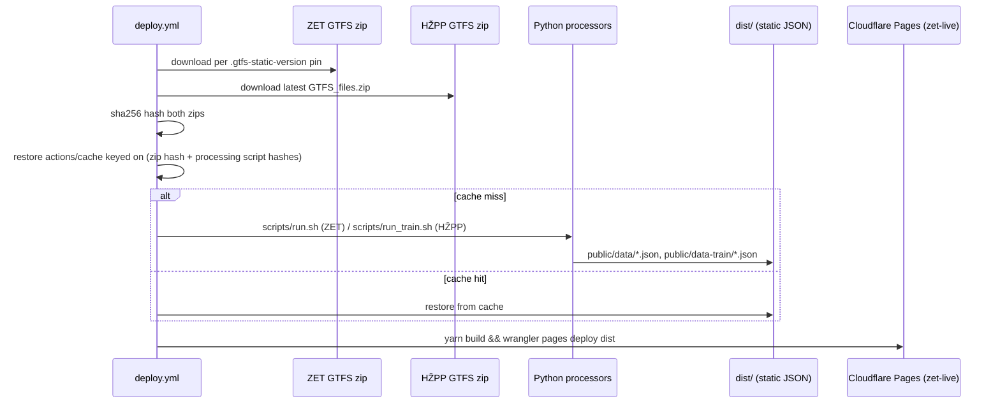
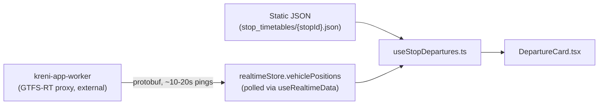

# Data flow

Two independent time scales: **build-time** (GTFS static data, minutes-to-weeks freshness) and **request-time** (realtime positions and alerts, seconds-to-minutes freshness).

## Build-time: GTFS slicing

Details: [[gtfs-zet]], [[gtfs-train]], [[cloudflare-pages-deploy]].

## Request-time: client fusion

Both the static timetable and the live GPS positions are keyed by `tripId`, so a scheduled departure and its live vehicle become the _same row_ in the departure board. Full fusion rules: [[stop-departures]] and [[gps-realtime-trust-model]].

## Alerts: two separate paths

- **Realtime GTFS-RT alerts** — parsed client-side from the same combined feed as vehicle positions, surfaced via `ServiceAlerts.tsx`.
- **AI-structured RSS alerts** — a completely separate, scheduled pipeline: ZET's RSS feed → Ollama Cloud → Cloudflare KV → read back through the proxy Worker. See [[service-alerts]] and [[ollama-integration]].

> [!note] The proxy Worker lives in a separate repo, but is documented here too
> `src/utils/realtime.ts` explicitly notes its types are "copied from kreni-app-worker/src/types.ts" — the Worker's source isn't part of this codebase (it's at `~/projects/zet-live-realtime-cf-worker`). Its internals — endpoints, caching, auth, its own cron trigger — are documented in [[gtfs-proxy-worker]] rather than treated as opaque; see also [[cloudflare-topology]] for how the two repos' Cloudflare resources connect.
