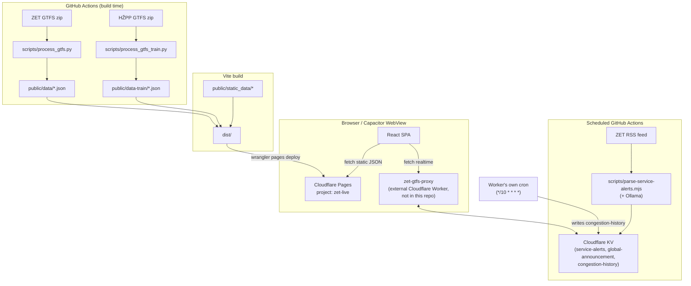

# Architecture overview

Kreni is a **static, database-less** React SPA. There is no application server and no SQL/NoSQL database anywhere in this stack — confirmed by repo-wide search (no `wrangler.toml`, no D1/R2/Durable Objects, no ORM). Everything that looks like "backend" is one of three things:

1. **Build-time data** — GTFS feeds are downloaded and sliced into sharded static JSON by CI, then deployed as static assets.
2. **An external Cloudflare Worker** (`kreni-app-worker`, deployed as `zet-gtfs-proxy`) that is **not part of this repository** (source at `~/projects/zet-live-realtime-cf-worker`). It proxies GTFS-Realtime, Nextbike, road-closures, serves the KV-backed service alerts / global announcement, and runs its own 10-minute cron to aggregate congestion history and refresh a set of Zagreb open-data datasets it caches in R2. This repo only knows it as `VITE_GTFS_PROXY_URL` — see [[environment-variables]] and, for the Worker's own internals, [[gtfs-proxy-worker]].
3. **Cloudflare KV**, written to directly by two standalone Node scripts running in GitHub Actions ([[ollama-integration]], [[scheduled-jobs]]), read back through the external Worker.

See [[gtfs-proxy-worker]] for what `zet-gtfs-proxy` and its own cron actually do.

## Why zero-database

All rider-facing data (routes, stops, timetables, shapes) changes on a GTFS feed's release cadence — days to weeks, not seconds. Baking it into static JSON at build time means the runtime path is just a CDN fetch: no query engine, no connection pool, no server to scale. The only genuinely dynamic data (vehicle positions, service alerts) is pushed through the external Worker + KV, which is enough for polling-based near-realtime without running a database.

See [[data-flow]] for the request-time and build-time paths in detail, and [[tech-stack]] for what each library in the client is used for.

> [!note] Not a monorepo
> There's no `apps/`, `packages/`, or `workers/` directory in this repo. It's a single Vite + React app plus a Capacitor Android wrapper (`android/`) and a Python/Node data pipeline (`scripts/`) that only ever runs in CI or locally before `yarn dev`.
