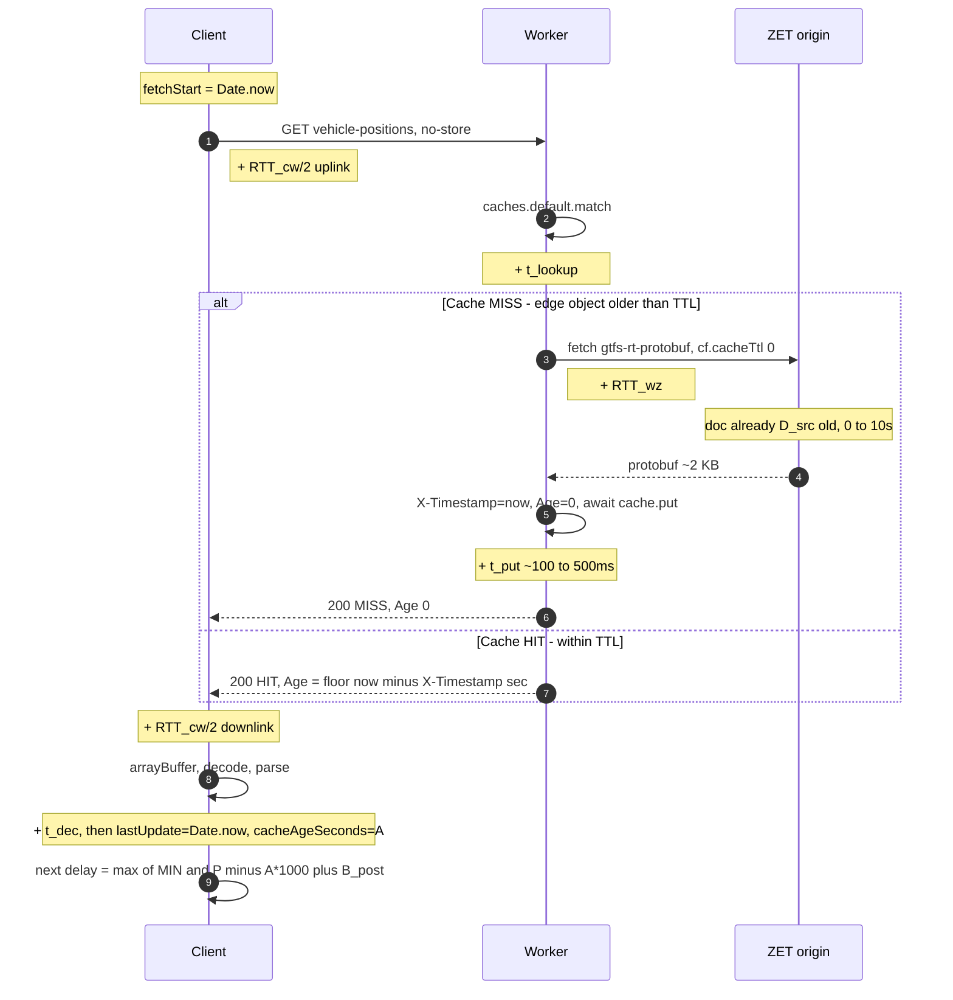
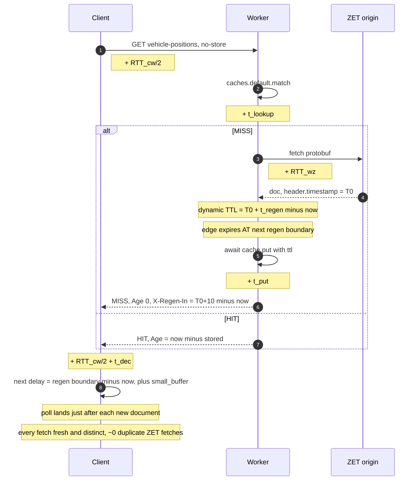

# Realtime Polling — Timing & Delay Budget

> [!note] What this is
> The precise timing of a **single live-feed poll** ("ping") from client to Worker to ZET and back, with _every_ delay term named and sourced to code. Tuning the poll interval was hard-won trial and error — this note is the authoritative record so any future change can reason about the whole delay stack, not just one number. Companion to the decision in [[0002-realtime-proxy-cost-and-cadence]]; the Worker itself is [[gtfs-proxy-worker]]; broader data flow is [[data-flow]]; what the feed can be trusted for is [[gps-realtime-trust-model]].

## The three independent clocks

The whole problem is that **three clocks run independently** and nothing synchronises them:

1. **ZET's regeneration clock** — the feed document is rebuilt every **10.0 s** (measured, see [[0002-realtime-proxy-cost-and-cadence]] / `scripts/probe-zet-cadence.mjs`). Nothing fresher than this exists.
2. **The Worker's edge-cache TTL** — `CACHE_TTL_SECONDS = 7`. Independent of ZET's boundaries.
3. **The client's poll timer** — `REALTIME_POLL_INTERVAL = 7000` ms, nudged each cycle by an adaptive delay derived from the response `Age` header.

Because none of these divide evenly or share a phase, "how stale is the data on screen" is a _sum of offsets between clocks_, not a single interval.

## Delay budget (every term, sourced)

| Symbol     | Delay                                         | Where             | Typical                                | Source                                                 |
| ---------- | --------------------------------------------- | ----------------- | -------------------------------------- | ------------------------------------------------------ |
| `t_regen`  | ZET feed regeneration period                  | ZET origin        | **10.0 s** (measured)                  | fixed server job; caps freshness                       |
| `D_src`    | age of ZET doc **when the Worker fetches it** | ZET origin        | 0–10 s                                 | uniform within a regen cycle                           |
| `RTT_cw`   | client ↔ Worker round trip                    | network + CF edge | ~30–120 ms                             | part of measured `fetchLatencyMs`, `utils/realtime.ts` |
| `RTT_wz`   | Worker ↔ ZET round trip (**MISS only**)       | network           | ~50–150 ms                             | direct `curl` ~73 ms from dev box                      |
| `t_lookup` | `caches.default.match()`                      | Worker            | <5 ms                                  | HIT and MISS, `index.ts`                               |
| `t_put`    | `caches.default.put()` (**awaited on MISS**)  | Worker            | ~100–500 ms                            | in-code comment, `index.ts` GTFS path                  |
| `t_dec`    | protobuf decode + parse + dead-reckoning      | client            | ~1–10 ms                               | `fetchAll()`, `realtimeStore.ts`                       |
| `A`        | `Age` response header                         | Worker → client   | 0–`TTL`                                | **integer seconds** → ±1 s quantization                |
| `B_post`   | `CACHE_POST_EXPIRY_BUFFER_MS`                 | client            | **1500 ms**                            | `useRealtimeData.ts`                                   |
| `MIN`      | `MIN_RETRY_DELAY_MS` (delay floor)            | client            | **1000 ms**                            | `useRealtimeData.ts`                                   |
| `TTL`      | edge cache TTL (`CACHE_TTL_SECONDS`)          | Worker            | **7 s** (unchanged)                    | `s-maxage` + `max-age`, `index.ts`                     |
| `P`        | `REALTIME_POLL_INTERVAL` (nominal target)     | client            | **10000 ms** (was 7000 pre-2026-07-12) | `config/index.ts`                                      |

> [!important] Invariant: `TTL ≤ P`
> The client scheduler (`getAdaptiveDelayMs`) uses `P` as a proxy for the cache lifetime. Keeping `TTL ≤ P` guarantees the next poll lands **after** the edge object expires → always a MISS → fresh data. If `TTL > P`, the client polls while the object is still valid → **stale HIT** → the delay formula yields a negative value clamped to `MIN` (1 s) → a **1-second rapid-repoll storm with paused vehicle markers**. As of 2026-07-12 the shipped state is `P = 10 s`, `TTL = 7 s` (invariant holds) — see §Shipped 2026-07-12.

> [!important] Why `Age`, not `X-Timestamp`
> The client schedules the next poll from the **server-derived `Age`** (whole seconds since the Worker stored the object), **not** from `X-Timestamp`. Comparing `X-Timestamp` against `Date.now()` folds in **client/server clock skew** (`±0–1000 ms+`) and consistently made the poll arrive _before_ the cache expired → wasted HITs. `Age` is relative to the server's own clock, so it is skew-free. This was a core outcome of the tuning battle.

## Historical — single ping (7 s config, before 2026-07-12)

> [!note] Superseded 2026-07-12
> This section documents the original `P = 7 s`, `TTL = 7 s` state and its ~8.5 s loop. **Step 1 raised `P` to 10 s (`TTL` stays 7 s)** — see §Shipped 2026-07-12. Kept here because the misalignment reasoning below is the "why" behind the change.

`cache: 'no-store'` on the client means **every poll reaches the Worker = 1 billed invocation**, HIT or MISS (see cost model in [[0002-realtime-proxy-cost-and-cadence]]).



### Data age on screen (worst case)

The number the user sees is stale by the **sum** of: how old ZET's doc was when cached, how long it then sat at the edge, and the downlink + decode:

```
data_age  ≈  D_src        (≤ t_regen = 10 s)
           + A            (≤ TTL      = 7 s, HIT path)
           + RTT_cw/2 + t_dec   (~ tens of ms)
           ≈  up to ~17 s + latency   (worst case)
```

### Steady-state cadence is ~8.5 s, not 7 s

This is the non-obvious part. After a MISS, `A = 0`, so:

```
next delay = max(1000, 7000 − 0·1000 + 1500) = 8500 ms
```

8.5 s **> TTL (7 s)**, so by the time the client polls again the edge object has already expired → **another MISS → `A=0` → 8500 ms again**. The loop is self-sustaining:

```
poll → MISS(Age0) → wait 8.5s → MISS(Age0) → wait 8.5s → …
```

So in practice: **client polls ~every 8.5 s, essentially always MISS, each poll triggering a fresh Worker→ZET fetch.** The `Age`-driven branch only bites for _bursts_ (window-focus / reconnect refetches landing inside the 7 s TTL), de-duplicating them to a HIT. It is **not** what sets the steady cadence.

### Why 7 s / 8.5 s is misaligned with 10 s

`TTL (7 s) < t_regen (10 s)` and the poll loop (~8.5 s) `< t_regen (10 s)`, so consecutive fetches sometimes land inside the **same** ZET 10 s window and pull a **byte-identical document** — a wasted Worker→ZET subrequest and no fresher data. Over `LCM`-ish spans roughly **1 in 7** fetches is a duplicate, and freshness never improves because the source is capped at 10 s.

```
ZET docs:   |--doc0--|--doc1--|--doc2--|--doc3--|--doc4--|--doc5--|--doc6--|
time(s):    0        10       20       30       40       50       60       70
polls(8.5): ^   ^     ^   ^    ^    ^   ^    ^    ^  (51→doc5, 59.5→doc5 = DUP)
            0  8.5   17  25.5 34  42.5 51  59.5 68
```

## Shipped 2026-07-12 — Step 1: `P = 10 s`, `TTL` stays 7 s

**Change:** `REALTIME_POLL_INTERVAL` 7000 → 10000 in `config/index.ts` (one line). The Worker's `CACHE_TTL_SECONDS` is **unchanged at 7** — deliberately frontend-only.

**Why frontend-only is safe (and why we did _not_ bump `TTL` in lockstep):** the only dangerous mismatch is `TTL > P` (client polls into a still-valid cache → stale HIT → 1 s repoll storm). Raising `P` to 10 while `TTL` stays 7 keeps `TTL(7) < P(10)`, the **benign** side: the client always overshoots the cache lifetime, so every poll is a MISS with fresh data. This is safe even for users still running an old cached bundle, because the _Worker_ didn't change. Steady state:

```
MISS(Age0) → delay = max(1000, 10000 − 0 + 1500) = 11500 ms → MISS(Age0) → …
```

- **Cadence ~11.5 s**, essentially always MISS, fresh & distinct each fetch (11.5 s ≥ 10 s regen window). **~26 % fewer requests** than the old 8.5 s loop.
- **Vehicle animation stays coherent:** `EASE_MS = P × 0.9` → 9 s glide (was 6.3 s); the snap cutoff `P × 2.5` → 25 s. Motion scales with cadence automatically (`vehicleAnimationTicker.ts`).
- **Data age:** typically ≈ `D_src` (≤ 10 s) + latency on the always-MISS path; ≤ ~17 s only on a rare focus-refetch HIT (bounded by `TTL = 7`).
- **UI:** `RealtimeStatusPanel` shows "10s" automatically (derives from `P`).

The remaining `TTL` 7 → 10 bump is an **optional Step 2** (below) — marginal multi-user cache-coalescing gain, _not_ required for the cost win, and only ever done while preserving `TTL ≤ P`.

## Optional Step 2 — single ping (10 s aligned at the Worker too)

> [!note] Step 1 (P = 10 s) already shipped
> These options describe the _further_ Worker-side change (`TTL` 7 → 10, or dynamic). They are optional; Step 1 already captured the ~26 % request cut. Do these only after Step 1 is fully rolled out, and never let `TTL` exceed `P`.

Two options; **B is recommended if you do this at all.** Both set `P = 10000` and `TTL = 10` at minimum.

### Option A — simple realignment

`REALTIME_POLL_INTERVAL = 10_000`, `CACHE_TTL_SECONDS = 10`. Steady-state MISS delay becomes `10000 − 0 + 1500 = 11500 ms`. Fresh & distinct every fetch (11.5 s ≥ 10 s window), ~30 % fewer requests than today — but the +1500 buffer now means you occasionally sit ~11.5 s between updates and skip ~15 % of documents. Fine given the [[gps-realtime-trust-model]] (no sub-minute ETAs), and a one-line change.

### Option B — phase-locked to ZET (recommended)

Make the **edge TTL dynamic** so the cache expires exactly when ZET emits the next document, then let the client's existing `Age` logic ride it with a **small** buffer.



With B, the client poll, the edge TTL, and ZET's regeneration all share **one boundary**. `data_age ≈ D_src(→ small, we poll right after regen) + RTT_cw/2 + t_dec`, i.e. close to the network floor, worst case ~`t_regen` + latency ≈ ~10 s rather than ~17 s. The buffer can shrink from 1500 ms (it no longer has to hide a 7-vs-10 mismatch, only `t_put` + skew).

### Current vs proposed at a glance

|                       | Historical (7/7) | **Step 1 ✅ (10/7)** | Option A (10/10) | Option B (phase-locked)      |
| --------------------- | ---------------- | -------------------- | ---------------- | ---------------------------- |
| Nominal `P` / `TTL`   | 7 s / 7 s        | **10 s / 7 s**       | 10 s / 10 s      | 10 s / dynamic to regen      |
| Steady-state loop     | ~8.5 s           | ~11.5 s              | ~11.5 s          | ~10 s (locked)               |
| Duplicate ZET fetches | ~1 in 7          | rare                 | rare             | ~none                        |
| Worst-case data age   | ~17 s + latency  | ~17 s + latency      | ~13 s + latency  | ~10 s + latency              |
| Requests vs 7/7 (old) | —                | ~−26 %               | ~−26 %           | ~−26 %                       |
| Change size           | —                | **one-liner ×1**     | one-liner ×2     | Worker logic + client buffer |

## When you change this — checklist

- [ ] Re-measure `t_regen` first (`scripts/probe-zet-cadence.mjs`, ideally at peak) — the entire budget keys off it.
- [ ] Preserve the invariant **`TTL ≤ P`**. Equal (Option A), `TTL` dynamic ≤ `P` (Option B), and `TTL < P` (Step 1: 7 ≤ 10) are all safe. The dangerous direction is **`TTL > P`**: the client then polls while the edge object is still valid → stale HIT → the delay formula clamps to `MIN` (1 s) → a rapid-repoll storm with paused vehicle markers. _(Corrects an earlier version of this checklist that named `TTL < P` as the failure — the failure is `TTL > P`.)_
- [ ] Preserve `Age`-based scheduling (skew-free); do **not** switch to `X-Timestamp` for timing.
- [ ] Re-tune `B_post` only after `TTL`/`P` are aligned — it exists to absorb `t_put` + skew, nothing else.
- [ ] Update the delay-budget table above and [[0002-realtime-proxy-cost-and-cadence]] together.

## Related

[[0002-realtime-proxy-cost-and-cadence]] · [[gtfs-proxy-worker]] · [[data-flow]] · [[gps-realtime-trust-model]] · [[cloudflare-topology]]
