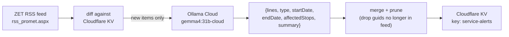

# Service alerts ("prometne obavijesti")

There are **two independent paths** that surface traffic notices to riders — don't confuse them.

## 1. Realtime GTFS-RT alerts (client-side, live)

Parsed directly from the same combined GTFS-RT feed as vehicle positions (`Alert` messages via `gtfs-realtime-bindings`), stored in `realtimeStore.serviceAlerts`, and rendered by `src/components/common/ServiceAlerts.tsx` — a badge on the map that expands into a full-screen panel, styled per the feed's `Alert.Effect` type. Surfaced directly on the map since the map-tools-menu removal (commit `05e79c8`) rather than hidden behind a FAB.

## 2. AI-structured RSS alerts (build-independent, scheduled)

A completely separate pipeline that turns ZET's unstructured Croatian-language RSS feed into structured JSON:

Implemented in `scripts/parse-service-alerts.mjs`, run every 4 hours by `.github/workflows/parse-service-alerts.yml` — see [[scheduled-jobs]] and [[ollama-integration]].

- **Diffing**: alerts are keyed by an MD5 hash of the RSS `guid` (first 12 hex chars). Only genuinely new guids are sent to the LLM — existing KV entries are reused verbatim, keeping the pipeline cheap.
- **Pruning**: any KV entry whose guid no longer appears in the live RSS feed is dropped on the next run.
- **Croatian-language system prompt** instructs the model to extract `lines`, `type` (`route-change` / `stop-change` / `cancellation` / `new-service` / `other`), `startDate`/`endDate` (ISO 8601 or `null`), `affectedStops` (Croatian stop names preserved), and a 1–2 sentence Croatian summary — returned as strict JSON (Ollama `format: 'json'` mode).
- **Failure mode**: if `OLLAMA_API_KEY` is unset or the call throws, the script falls back to a default `{type: 'other', summary: <RSS title>}` record rather than failing the whole run.
- The frontend consumes this KV entry through the external proxy Worker's `?endpoint=service-alerts` route (`useRssServiceAlerts.ts`), not directly — 5-minute edge cache on that route. See [[gtfs-proxy-worker]].

> [!note] `service-alerts` and `announcement` are two different KV keys/routes
> Don't confuse this pipeline's `service-alerts` key with the separate `global-announcement` key (`?endpoint=announcement` on the proxy Worker) — the latter is a manually-triggered, app-wide banner (`global-announcement.yml`, see [[scheduled-jobs]]), unrelated to ZET's RSS feed.

> [!note] Why two paths instead of one
> GTFS-RT alerts are timely but often just say "detour" without rider-friendly detail. The RSS→LLM path exists because ZET's actual detailed service-change announcements are published as free-text RSS, not GTFS-RT — the two are complementary, not redundant. In fact, the proxy Worker's own GTFS-RT decoding confirms ZET's feed consistently ships **zero** `Alert` entities — see [[gtfs-proxy-worker]] — so the RSS→LLM path isn't just complementary, it's currently the _only_ source of any detailed alert content.
