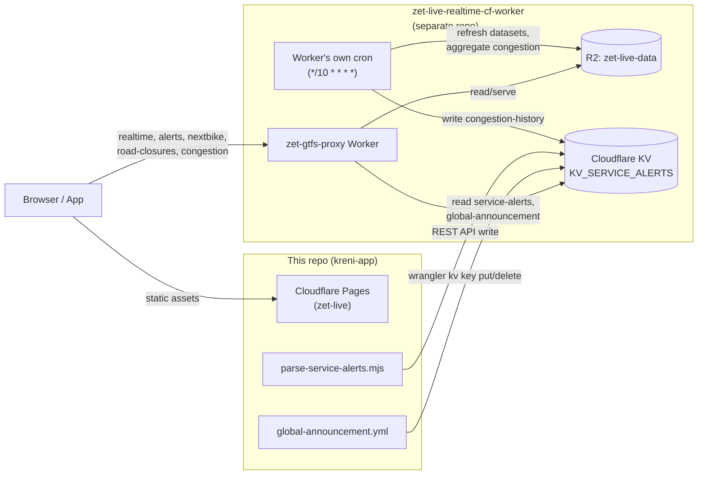

# Cloudflare topology

There is **no `wrangler.toml`/`wrangler.jsonc` anywhere in this repo** (confirmed by repo-wide search). All Cloudflare interaction is driven ad hoc from GitHub Actions secrets, not from a committed Workers config.

## What lives in this repo

- **Cloudflare Pages** — project `zet-live`, the static hosting target for `dist/` (serves `kreni.app`). Deployed via `cloudflare/wrangler-action@v4` in `deploy.yml` — see [[cloudflare-pages-deploy]].
- **Cloudflare KV writes** — two GitHub Actions scripts write directly to a KV namespace (ID passed as secret `CF_KV_NAMESPACE_ID`) via the raw Cloudflare REST API:
  - `scripts/parse-service-alerts.mjs` → key `service-alerts` (see [[service-alerts]], [[ollama-integration]])
  - `global-announcement.yml` → key `global-announcement`, via `wrangler kv key put`/`kv:key delete` (see [[scheduled-jobs]])
- **No D1, R2, or Durable Objects** anywhere in this repo (confirmed by repo-wide grep).

## What does NOT live in this repo

- **`kreni-app-worker`** (deployed name `zet-gtfs-proxy`) — the GTFS-Realtime proxy Worker, source at `~/projects/zet-live-realtime-cf-worker`. Reached via `VITE_GTFS_PROXY_URL`, which in production points at the **`api.kreni.app` Workers Custom Domain** (proxied / orange-clouded on the `kreni.app` zone — verified 2026-07-12 via the CF API, correcting an earlier claim here that there was "no custom domain configured"). As of 2026-07-12 the default `*.workers.dev` route (`zet-gtfs-proxy.mateo1559.workers.dev`) and Preview URLs are **disabled**, so `api.kreni.app` is the _only_ ingress. This matters for security and billing: a proxied custom domain sits behind the zone's **WAF + rate-limiting + DDoS**, and requests blocked there **do not count as Worker invocations** — whereas `workers.dev` bypasses all of it (see [[infra-scaling-and-monetization]]). Full detail — endpoints, cache TTLs, auth, CORS, its own cron trigger, KV/R2 bindings — is documented in **[[gtfs-proxy-worker]]** rather than duplicated here, since it's substantial enough to warrant its own note.

  In short: it serves GTFS-RT vehicle positions/trip updates, service alerts + global announcement (reading back the two KV keys this repo writes), Nextbike, road closures, congestion history, and a generic Zagreb-open-data passthrough (mostly unused by this frontend). `src/utils/realtime.ts` explicitly notes its types are "copied from kreni-app-worker/src/types.ts". See [[environment-variables]] for the env var that points at it, and [[0001-mobile-platform-strategy]] for why this data-layer/client split is considered the portable, protect-worthy asset of the whole project.

- **The Worker's own KV namespace and R2 bucket** are also not part of this repo's config — this repo only knows the KV namespace by its ID (`CF_KV_NAMESPACE_ID` secret) and writes to it via raw REST calls / `wrangler kv`, without ever declaring a binding itself (there's no `wrangler.toml` here at all, see above). The R2 bucket (`DATA_BUCKET` / `zet-live-data`) backs the Worker's own dataset cache and isn't touched by this repo in any way. Note the same bucket is **also exposed publicly at the `data.kreni.app` custom domain** (a proxied `CNAME → public.r2.dev` on the `kreni.app` zone) — the frontend uses this host for R2-served assets, distinct from the Worker's `api.kreni.app`.

> [!info] Custom domains on this account (verified 2026-07-12)
> `api.kreni.app` → Worker `zet-gtfs-proxy` · `data.kreni.app` → R2 `zet-live-data` · `kreni.app` → Pages `zet-live`. (A second, unrelated Pages project `aeoden96-github-io` serves the personal site `mteo.dev` from the same CF account — nothing to do with Kreni.) Account subdomain is `mateo1559`.

See [[gtfs-proxy-worker]] for what each piece of that diagram actually does.
